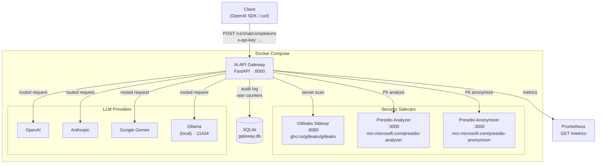
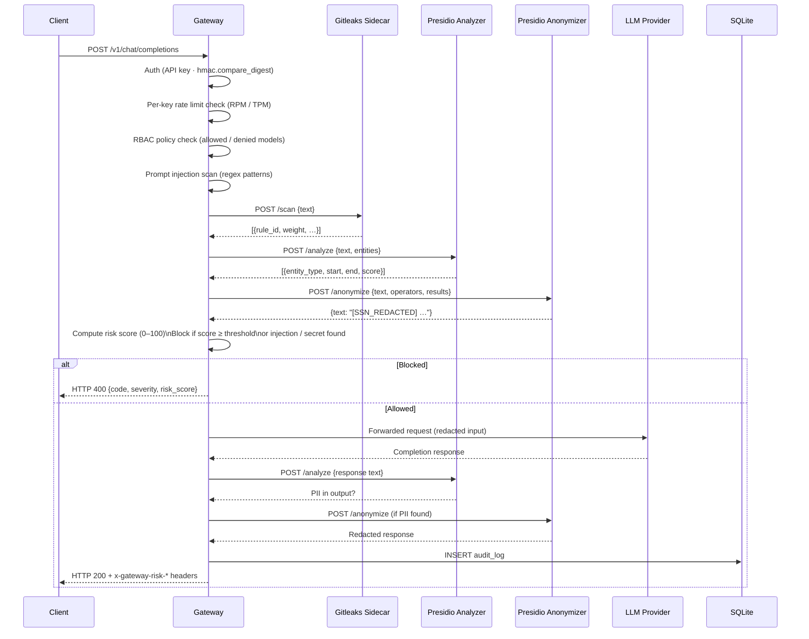

# Architecture

For focused design diagrams, see [HLD.md](HLD.md) for the high-level design and [LLD.md](LLD.md) for the low-level module design.

## Service Graph



## Request Lifecycle



## Component Map

```
AI-API-GATEWAY/
├── app/
│   ├── main.py                   FastAPI app factory, middleware, lifespan
│   ├── config.py                 All settings via env vars (pydantic-settings)
│   ├── auth.py                   API key validation — timing-safe (hmac.compare_digest)
│   ├── db.py                     SQLite: audit logs, rate limit counters, cost tracking
│   ├── rate_limit.py             Per-key sliding-window RPM/TPM enforcement
│   ├── metrics.py                Prometheus custom counters and histograms
│   ├── state.py                  In-memory request counters (reset on restart)
│   │
│   ├── api/
│   │   ├── v1/
│   │   │   ├── chat.py           POST /v1/chat/completions  (core inference)
│   │   │   └── models.py         GET  /v1/models
│   │   └── gateway/
│   │       ├── health.py         GET  /gateway/health
│   │       └── admin.py          GET  /gateway/stats  |  GET /gateway/audit
│   │
│   ├── clients/
│   │   ├── gitleaks.py           HTTP client → gitleaks sidecar
│   │   └── presidio.py           HTTP client → presidio-analyzer + anonymizer
│   │
│   ├── pipeline/
│   │   ├── base.py               Finding dataclass, PreProcessor / PostProcessor ABCs
│   │   ├── scoring.py            Risk score aggregation (0–100, severity label)
│   │   ├── pre/
│   │   │   ├── prompt_injection.py   LLM01: regex pattern detection
│   │   │   ├── secret_detection.py   Calls gitleaks sidecar
│   │   │   ├── pii_input.py          Calls Presidio (input side)
│   │   │   └── policy.py             RBAC: allowed / denied model enforcement
│   │   └── post/
│   │       └── pii_output.py         Calls Presidio (output side)
│   │
│   ├── providers/
│   │   ├── base.py               BaseProvider ABC: complete() / stream() / list_models()
│   │   ├── openai.py             OpenAI adapter
│   │   ├── anthropic.py          Anthropic adapter
│   │   ├── google.py             Google Gemini adapter (google-genai SDK)
│   │   ├── ollama.py             Ollama adapter (local models)
│   │   └── router.py             Model-prefix routing + fallback chain resolution
│   │
│   └── schemas/
│       ├── openai_compat.py      OpenAI-compatible request / response models
│       └── gateway.py            Extended gateway schemas
│
├── services/
│   └── gitleaks-sidecar/
│       ├── Dockerfile            Multi-stage: gitleaks binary + python:3.11-slim
│       ├── main.py               FastAPI wrapper around gitleaks binary
│       └── requirements.txt
│
├── config/
│   ├── gitleaks_rules.toml       22 bundled secret detection rules (with weights)
│   ├── fallbacks.yaml            Fallback routing chains per model
│   └── policies.yaml.example    RBAC policy template
│
├── tests/
│   ├── conftest.py
│   ├── test_api.py               API-level tests (mocked providers + sidecars)
│   └── test_pipeline_pre.py      Pipeline unit tests
│
├── docker-compose.yml            Full service graph (gateway + 4 sidecars)
├── Dockerfile                    Gateway image (no NLP deps — thin)
├── pyproject.toml
├── requirements.txt              Pinned runtime deps
└── requirements-dev.txt
```

## Security Pipeline — Data Flow

```
Incoming request
      │
      ▼
┌─────────────────────────────────────────────────────────┐
│  AUTH                                                   │
│  • API key presence check                               │
│  • hmac.compare_digest timing-safe comparison           │
│  • Per-key RPM / TPM sliding window                     │
└────────────────────────┬────────────────────────────────┘
                         │
                         ▼
┌─────────────────────────────────────────────────────────┐
│  PRE-PROCESSING PIPELINE                                │
│                                                         │
│  1. Policy Enforcer      (sync)  RBAC allow/deny        │
│  2. Prompt Injection     (sync)  10 regex patterns      │
│  3. Secret Detection     (async) → gitleaks sidecar     │
│  4. PII Input Scan       (async) → Presidio sidecar     │
│                                                         │
│  → Findings collected as Finding(code, label, weight)   │
│  → Risk score = min(100, Σ weights)                     │
│  → Block if: weight≥100 OR secret found OR              │
│              injection+block_mode OR score≥threshold    │
└────────────────────────┬────────────────────────────────┘
                         │ (if not blocked)
                         ▼
┌─────────────────────────────────────────────────────────┐
│  PROVIDER ROUTING                                       │
│  • Model-prefix → provider (gpt-* → OpenAI, etc.)      │
│  • Fallback chain on error (config/fallbacks.yaml)      │
└────────────────────────┬────────────────────────────────┘
                         │
                         ▼
                  [LLM Provider]
                         │
                         ▼
┌─────────────────────────────────────────────────────────┐
│  POST-PROCESSING PIPELINE                               │
│  • PII Output Scan (async) → Presidio sidecar           │
│    redact / flag / off                                  │
│  • Streaming: buffer → scan → re-stream                 │
└────────────────────────┬────────────────────────────────┘
                         │
                         ▼
┌─────────────────────────────────────────────────────────┐
│  AUDIT + METRICS                                        │
│  • Write to SQLite audit_logs                           │
│  • Increment Prometheus counters                        │
│  • x-gateway-risk-* headers on response                 │
└────────────────────────┬────────────────────────────────┘
                         │
                         ▼
                    Client response
```
