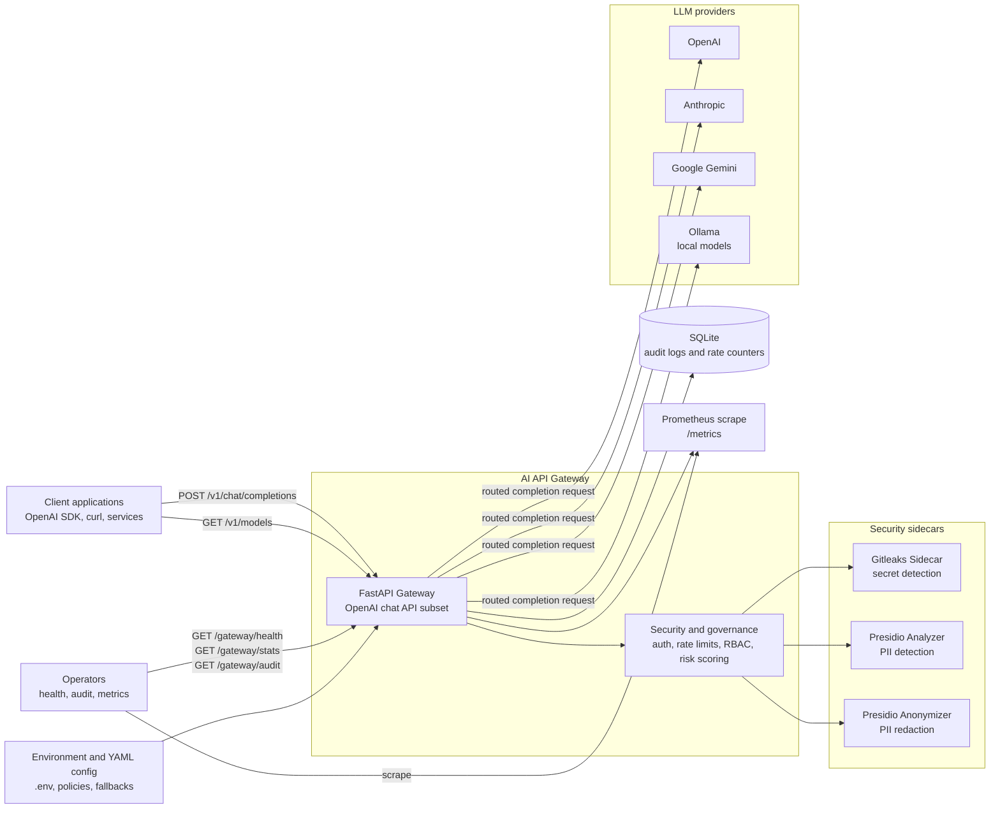
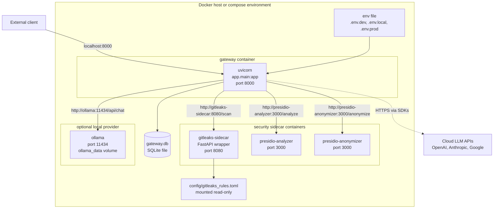
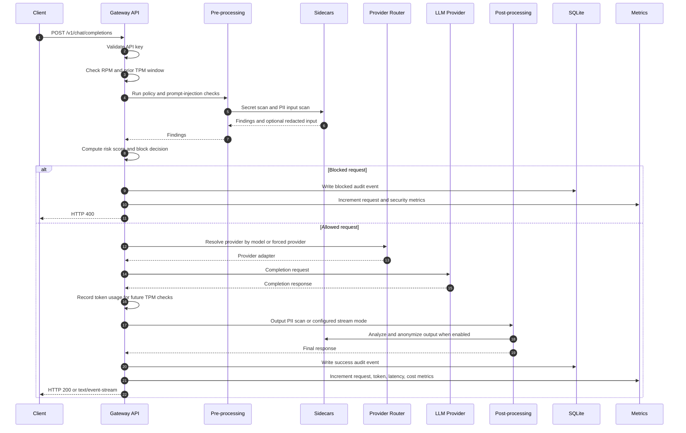

# High-Level Design

This document shows the high-level architecture for the AI API Gateway. It focuses on system boundaries, deployment topology, and the main request path.

## System Context

## Deployment View

## Request Lifecycle

## High-Level Responsibilities

| Area | Responsibility |
|---|---|
| API Gateway | Exposes OpenAI-compatible chat and model endpoints, gateway health, audit, stats, and metrics. |
| Security pipeline | Enforces API key auth, rate limits, RBAC policies, prompt-injection checks, secret detection, PII detection, and risk scoring. |
| Provider routing | Maps models to providers by prefix and applies configured fallback chains for non-streaming completions. |
| Sidecars | Keep heavy or specialized security tooling out of the gateway runtime image. |
| Persistence | Stores audit events and rate-limit counters in SQLite. |
| Observability | Exposes Prometheus metrics and lightweight admin endpoints. |
| Configuration | Uses environment variables for runtime settings and YAML files for policies and fallbacks. |
