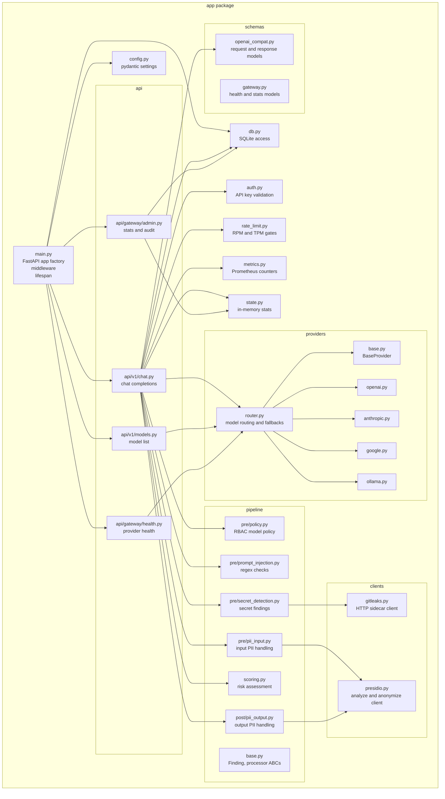
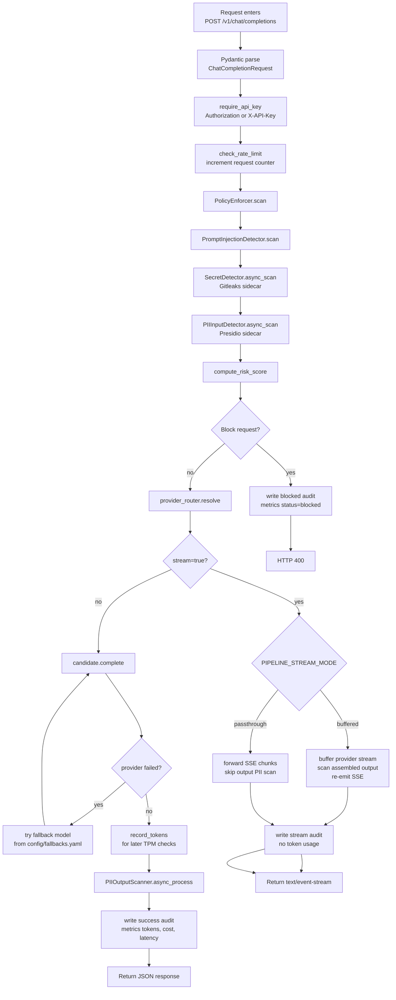
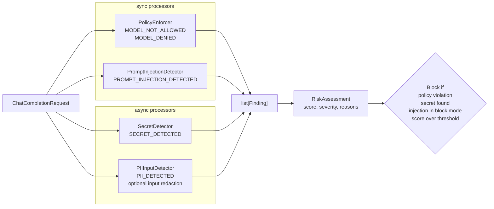
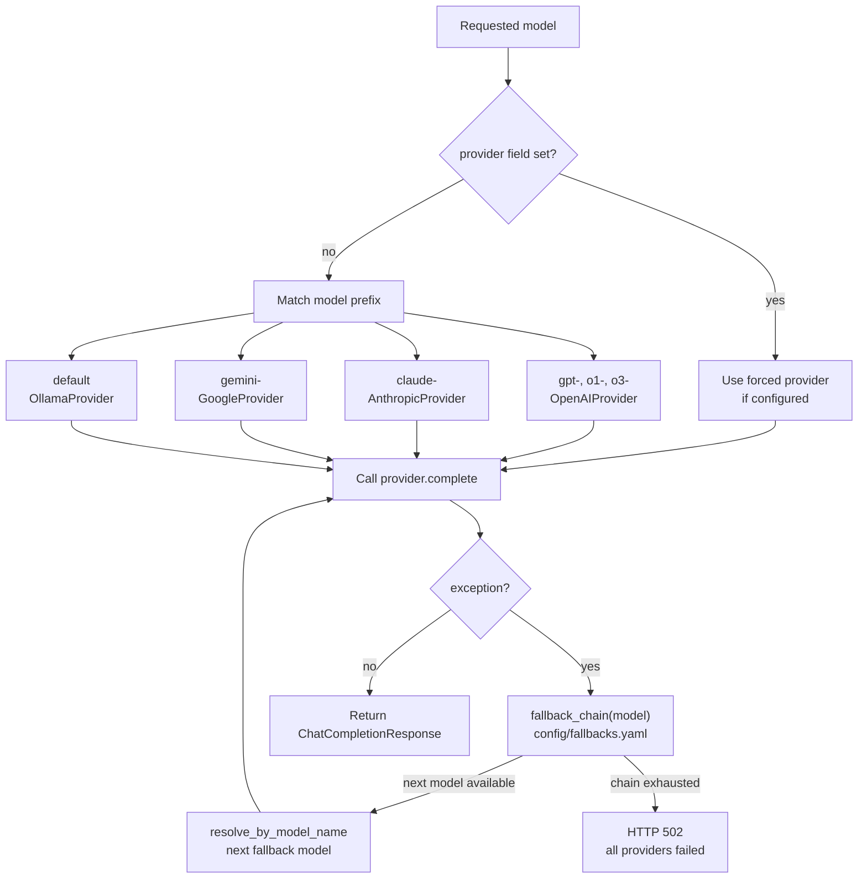
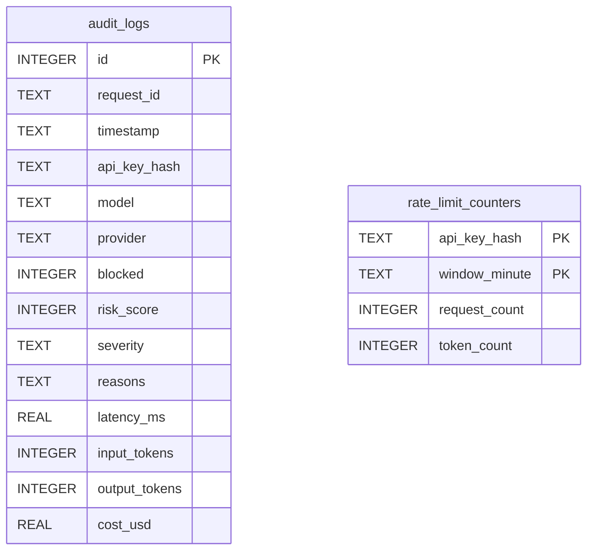

# Low-Level Design

This document shows the low-level module design for the AI API Gateway. It focuses on code-level responsibilities and the internal request flow.

## Internal Component Diagram

## Chat Completion Flow

## Pre-Processing Pipeline

## Provider Routing and Fallback

## Persistence Model

## Key Runtime Modes

| Mode | Setting | Behavior |
|---|---|---|
| Development mode | `GATEWAY_ENV=development` | Allows fail-open sidecars and verbose errors for local work. |
| Production mode | `GATEWAY_ENV=production` | Startup validation rejects missing API keys, fail-open sidecars, verbose errors, disabled PII scanning, and non-blocking injection mode. |
| Buffered streaming | `PIPELINE_STREAM_MODE=buffered` | Buffers stream output, scans/redacts PII, then re-emits SSE chunks. Safer, higher latency. |
| Passthrough streaming | `PIPELINE_STREAM_MODE=passthrough` | Forwards chunks as they arrive and skips output PII scanning. Lower latency, less safe. |
| PII redaction | `PIPELINE_PII_MODE=redact` | Replaces detected PII before provider calls and after provider responses. |
| PII flagging | `PIPELINE_PII_MODE=flag` | Records findings without mutating text. |
| Fail-closed sidecars | `SIDECAR_FAIL_CLOSED=true` | Blocks requests if security sidecars are unreachable. |
